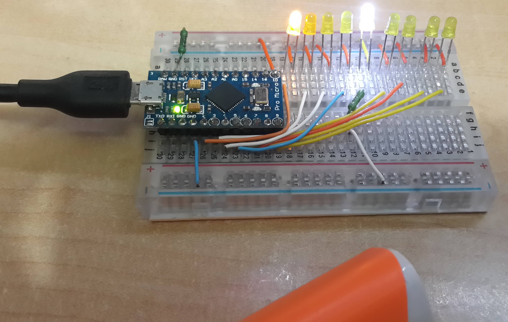
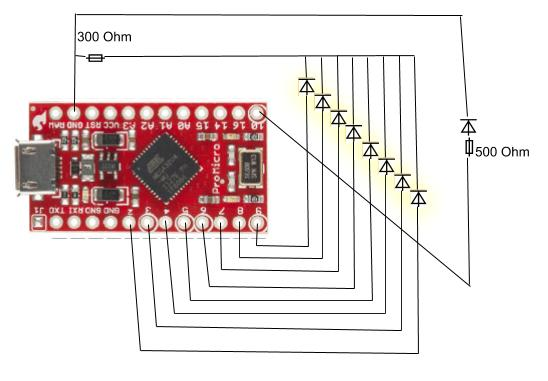

# Hanukkino
Use arduino-like pro micro clone (atmega32U4) to light your Hanukkah
## Breadboard photo

## Wiring diagram

## Power source
You can use a simple microUSB power bank or wall charger, or directly wire 5V battery to VCC or 6-12V battery to RAW pins of the board.
### Happy Hanukkah hacking!
